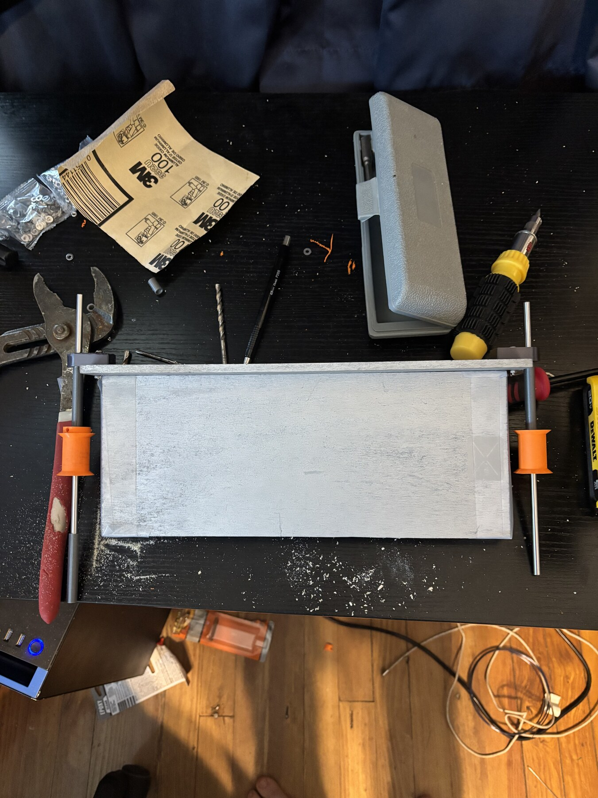
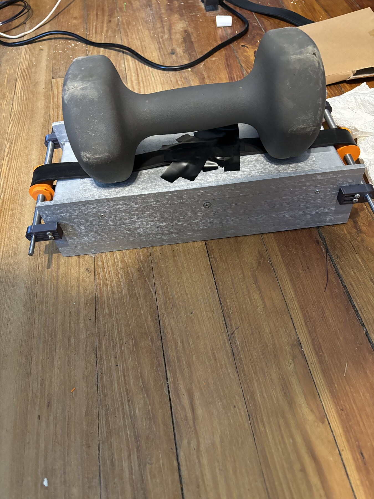
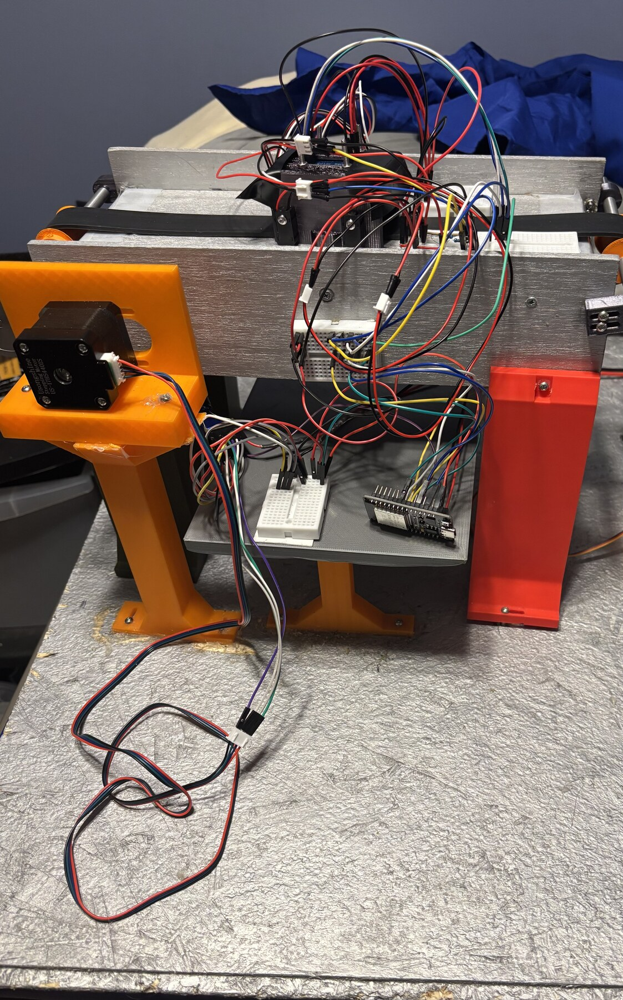

# LEGO Brick Sorter

An ESP32-controlled conveyor that identifies red and blue 2x2 and 2x3 LEGO
bricks, then routes them into four bins with a servo-driven rotary chute. I
built the machine for the 2026 TSA System Control Technology event.


Over a roughly one-month, 200-hour development cycle, I worked across the
mechanical design and CAD, power and signal planning, fabrication, firmware,
calibration, and full-system debugging. At its fastest observed operating
point, the completed sorter processed approximately **0.3 bricks/second**, or
**18 bricks/minute**.

## Working demo

<a href="https://www.youtube.com/watch?v=zOtNFu6YxYQ"></a>

**[Watch the 32-second operating demo on YouTube](https://www.youtube.com/watch?v=zOtNFu6YxYQ).**
The video shows the final conveyor, sensor assembly, rotary chute, and four-bin
layout running as an integrated system.

## System at a glance

A NEMA17 motor drives each brick along the GT2 conveyor and through two break
beams. Between them, a shrouded TCS3200 sensor samples the brick's color. The
ESP32 combines the color reading with timing from the break beams to classify
the brick by size and color, then turns the servo-driven rotary chute toward
the corresponding bin.

- **Mechanics:** dimension-driven conveyor, adjustable sensor mounts, rotary
  chute, and four-bin collection arc
- **Electronics:** ESP32, TMC2209 stepper driver, two break beams, TCS3200 color
  sensor, high-torque servo, fused battery input, and separate voltage rails
- **Firmware:** interrupt-backed edge timing, moving color sampling,
  operator-assisted calibration, NVS persistence, and an event-driven state
  machine
- **Output classes:** 2x2 red, 2x3 red, 2x3 blue, and 2x2 blue

The controller processes one brick at a time across five states: `FEED`,
`SENSING`, `ROUTING`, `HANDOFF`, and `CONFIRM`. It commits the chute position
before the brick reaches the end of the belt.

## Engineering highlights

### Designing from physical constraints

The machine was designed as a connected chain of dimensions rather than a set
of independent parts. Starting with the brick envelope established the usable
belt width and sensing region. Those dimensions constrained the chute mouth and
sweep, which set the bin arc, conveyor height, and the remaining motor,
electronics, and support geometry. Adjustment slots at key interfaces gave the
physical build room for belt tension, print variation, and alignment.

The full dimensional reasoning and build sequence are documented in
[BUILD.md](BUILD.md#constraint-driven-mechanical-design).

### Measuring size as the belt moves

The two break beams are separated by **40.436 mm**. Instead of classifying a
brick from a fixed obstruction time, the firmware estimates belt velocity from
each brick's transit between the beams:

```text
v_lead  = d / (t_B,in  - t_A,in)
v_trail = d / (t_B,out - t_A,out)
```

When both estimates are valid, they are averaged. Brick length is then
estimated from velocity multiplied by the time each beam remains blocked. This
keeps the size threshold tied to physical length even as belt tension, friction,
or motor speed changes. The firmware also compares the two length estimates and
handles incomplete or noisy edge sequences explicitly.

[Read the implemented timing and fallback logic](ARCHITECTURE.md#size-measurement)
or inspect [`sensors.cpp`](firmware/tsa_sorter/sensors.cpp).

### Separating brick color from the moving belt

The TCS3200 cycles through red, blue, and clear filters while a brick crosses
the sensing station. The firmware aggregates multiple samples, subtracts a
captured moving-belt baseline channel by channel, rejects low-signal readings,
and classifies the resulting red/blue relationship.

Calibration is operator-assisted: known bricks establish the working color and
size thresholds, and the selected values and belt baseline are saved in ESP32
NVS. This made it possible to recalibrate the machine without recompiling the
firmware.

### Integrating power, sensing, and control

I sketched the power distribution and signal paths before wiring the machine. A
fuse sits after the battery input, the stepper driver uses the higher-voltage
motor path, and buck conversion supplies the lower-voltage ESP32 and peripheral
rail. The control firmware combines interrupt-time sensor capture with a
64-entry event queue, scheduled chute motion, a single active brick record, and
safe output states for invalid routes or queue overflow.

The [electrical section in BUILD.md](BUILD.md#electrical) includes the original
planning sketches and current firmware pin map. The complete state flow and
failure behavior are in [ARCHITECTURE.md](ARCHITECTURE.md).

## From sketches to a working machine

The first two to three weeks focused on dimensional planning, component
selection, ordering, sketches, and CAD. Fabrication, electronics integration,
firmware, calibration, and debugging came together in a concentrated final
two-week build sprint.

| Frame and rollers | Belt curing and alignment | Electronics integration |
| --- | --- | --- |
|  |  |  |

[See the complete build, wiring, and calibration guide](BUILD.md).

## Explore the project

| Area | Start here |
| --- | --- |
| Firmware and calibration tools | [`firmware/`](firmware/) |
| Control flow and sensing math | [ARCHITECTURE.md](ARCHITECTURE.md) |
| Mechanical build and electrical planning | [BUILD.md](BUILD.md) |
| Conveyor CAD export | [`cad/exports/conveyor-assembly.step`](cad/exports/conveyor-assembly.step) |
| Active-system parts list | [`hardware/BOM.csv`](hardware/BOM.csv) |
| Component references | [`docs/datasheet/`](docs/datasheet/) |

Build both PlatformIO environments from the repository root:

```sh
cd firmware
pio run
pio run -e servo_tuning
```

The main firmware is organized by responsibility:

- [`sensors.cpp`](firmware/tsa_sorter/sensors.cpp) — beam timing, TCS3200
  sampling, classification, and calibration data
- [`state_machine.cpp`](firmware/tsa_sorter/state_machine.cpp) — sequential
  feed, sense, route, handoff, and confirmation flow
- [`actuators.cpp`](firmware/tsa_sorter/actuators.cpp) — conveyor profiles,
  servo positioning, and fail-safe outputs
- [`test_harness.cpp`](firmware/tsa_sorter/test_harness.cpp) — serial commands
  for calibration and component testing

## Project role

This was a team TSA project. I am Joe Roche, and I physically built the sorter
while working across its mechanical/CAD, electrical, firmware, calibration, and
integration work.

## License

This repository is available under the [MIT License](LICENSE).
