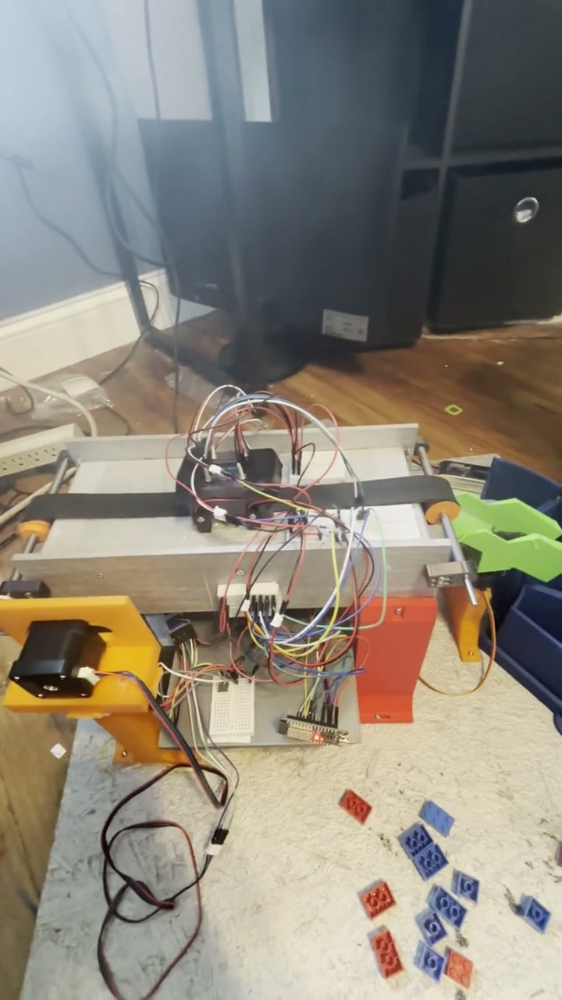
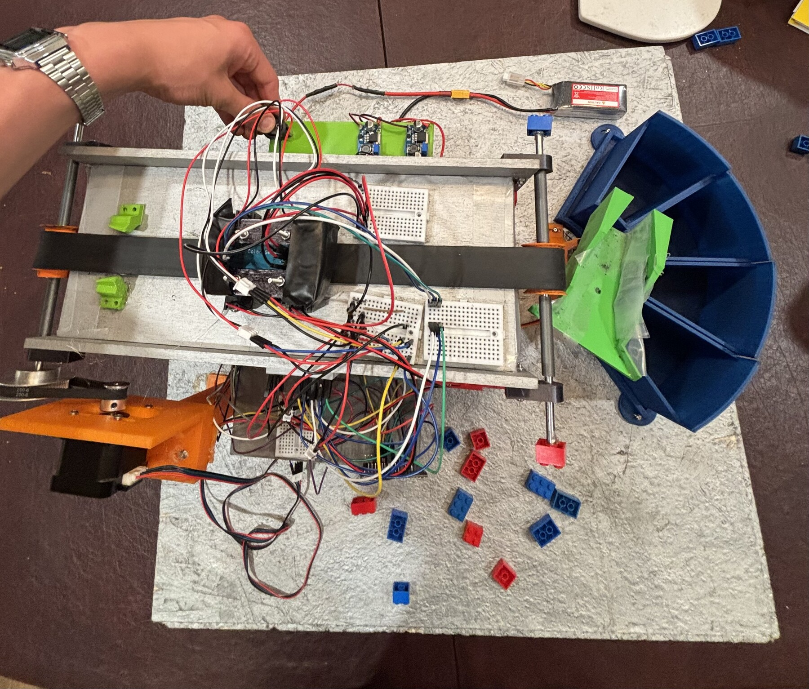

# LEGO Brick Sorter

An ESP32-controlled conveyor that classifies red and blue 2x2 and 2x3 LEGO
bricks, then positions a servo-driven chute over one of four bins. The project
was built for the 2026 TSA System Control Technology event.

This repository is the compact technical record: buildable firmware, an
operator-assisted calibration workflow, a reconstruction guide, an
authentic-source bill of materials, selected component references, and a
conveyor CAD export.

Joe Roche physically built the sorter and worked across its mechanical/CAD,
electrical, and firmware systems over approximately 200 hours of development.
The working machine reached a firsthand-observed peak of approximately 0.3
bricks/second (about 18 bricks/minute); no accuracy percentage is claimed.

Over roughly one month, I moved from dimensional sketches and component
selection to a working multidisciplinary machine. Early planning and CAD made
it possible to concentrate fabrication, wiring, firmware integration,
calibration, and debugging into an intensive final two-week build sprint.

## Physical proof

[](media/final/sorter-demo.mp4)

**[Watch the 32-second operating demo](media/final/sorter-demo.mp4).** This is
authentic physical evidence from the completed project, not a reconstructed
simulation or a quantified acceptance run.



The final assembly shows the conveyor, sensing region, servo-driven chute, and
four-bin output arc after mechanical alignment. The machine is now disassembled.

## System overview

```text
single-brick feed
  -> NEMA17 / GT2 conveyor
  -> two break-beams + shrouded TCS3200 sensor
  -> size and color classification
  -> timed MG995/MG996 chute position
  -> one of four labeled bins
```

The firmware measures each beam's blocked duration and the transit time
between beams. From those timings it estimates belt speed and brick length.
The color sensor samples red, blue, and clear channels; when a belt baseline is
available, it subtracts that baseline before computing `red / (red + blue)`.
The current controller deliberately owns one `BrickRecord` at a time so the
chute is committed before that brick reaches the belt exit.

I also sketched the full power and signal layout before wiring: a fused battery
input limits fault current, while separate 12 V motor and buck-converted 5 V
paths protect lower-voltage electronics from the motor rail. The original
planning sketches and current pin map are in [BUILD.md](BUILD.md#electrical).

### Constraint-driven mechanical design

I designed the machine as a chain of dimensional constraints instead of sizing
parts independently: LEGO geometry set the belt and chute-mouth envelope; the
chute set the bin arc, clearance, and servo support; chute entry height then set
the conveyor, NEMA17 mount, and electronics-underbody envelopes. Adjustment
slots preserved millimeter-scale alignment tolerance for the physical build.
This upfront dependency planning reduced avoidable reprints and rework without
pretending the machine required no iteration. See the [build progression and
fit notes](BUILD.md#constraint-driven-mechanical-design).

### Dynamic two-beam size sensing

With active beam spacing $d=40.436\text{ mm}$, the firmware timestamps the
leading and trailing edges at both beams and computes:

$$
v_{lead}=\frac{d}{t_{B,in}-t_{A,in}},\qquad
v_{trail}=\frac{d}{t_{B,out}-t_{A,out}},\qquad
v=\frac{v_{lead}+v_{trail}}{2}
$$

It then estimates $L_A=v(t_{A,out}-t_{A,in})$ and
$L_B=v(t_{B,out}-t_{B,in})$, combining or selecting them according to edge
counts and speed/length skew. Measuring velocity on each pass keeps the size
threshold tied to millimeters instead of a fixed beam-occlusion time, so belt
tension, friction, and firmware speed changes do not automatically invalidate
classification. The exact fallback gates are documented in
[ARCHITECTURE.md](ARCHITECTURE.md#size-measurement).

### Color sensing and calibration

I established the red/blue reference behavior through repeated passes of known
bricks. During each pass the TCS3200 cycles red, blue, and clear filters,
averages multiple pulse-period readings, subtracts the operator-captured belt
baseline channel-by-channel, rejects low-signal samples, and classifies the
averaged net ratio $R_{net}/(R_{net}+B_{net})$. Threshold selection remains
operator-assisted and is persisted with the belt baseline in ESP32 NVS.

### Event-driven control

Interrupts timestamp beam edges into a 64-slot event queue; the controller then
moves one brick through `FEED -> SENSING -> ROUTING -> HANDOFF -> CONFIRM`.
Measured speed and length schedule the chute before the brick reaches the belt
exit, while startup output clamps, queue-overflow detection, route validation,
and a single-record token guard stop unsafe control paths. The current firmware
is sequential rather than multi-brick: a second brick must not enter the sensing
window until the previous timed confirmation starts the next cycle.

| Bin | Classification | Target count in the event set |
| --- | --- | ---: |
| 1 | 2x2 red | 6 |
| 2 | 2x3 red | 4 |
| 3 | 2x3 blue | 8 |
| 4 | 2x2 blue | 6 |

The counts above describe the configured 24-brick test set. They are not a
claim that a physical acceptance run has passed.

## Calibration

Calibration is **operator-assisted**, not automatic threshold fitting. The
firmware can capture a moving-belt baseline, display the active settings,
accept manually selected color and size thresholds, and persist the resulting
profile in ESP32 NVS. Selecting thresholds still requires reviewing real runs
from the assembled machine.

See [BUILD.md](BUILD.md#calibration) for the procedure and commands.

## Evidence and verification

| Check | Current evidence |
| --- | --- |
| Main ESP32 firmware | PlatformIO build passes |
| Servo-tuning utility | PlatformIO `servo_tuning` build passes |
| Physical operation | Authentic 32-second sorter demo committed above |
| Physical 24-brick result | No matching uninterrupted video + serial-log evidence claimed |
| Throughput | Firsthand peak estimate: approximately 0.3 bricks/s (18 bricks/min) |
| Accuracy | No percentage claimed; add only if supported by a documented run |
| Wiring diagram | TODO: add `hardware/wiring.png` after validating it against the machine |
| Procurement and component constraints | Active-system BOM plus selected original datasheets and CAD references |
| CAD provenance | TODO: confirm authorship, finality, and redistribution approval for the conveyor STEP export |

No browser simulator is included in this portfolio tree. It was useful during
development, but the physical firmware and hardware evidence are the relevant
public artifacts.

## Code tour

- [Sensor sampling and classification](firmware/tsa_sorter/sensors.cpp)
- [Sequential control state machine](firmware/tsa_sorter/state_machine.cpp)
- [Conveyor and chute actuation](firmware/tsa_sorter/actuators.cpp)
- [Serial calibration and test harness](firmware/tsa_sorter/test_harness.cpp)

## Build and repository map

1. Follow [BUILD.md](BUILD.md) for mechanical assembly, wiring, flashing, and
   calibration.
2. Read [ARCHITECTURE.md](ARCHITECTURE.md) for the data and control flow.
3. Review [hardware/BOM.csv](hardware/BOM.csv) for the active-system parts.
4. Review [docs/datasheet/README.md](docs/datasheet/README.md) for the retained
   component constraints and why each reference is present.
5. Build the firmware with the commands in [firmware/README.md](firmware/README.md).

The conveyor export is at
[`cad/exports/conveyor-assembly.step`](cad/exports/conveyor-assembly.step).
Editable source CAD and final-system renders are not included yet.

## Team and authorship

This was a team TSA project, and the Git history contains multiple
contributors. Joe physically built the machine and contributed across the
mechanical/CAD, electrical, and firmware work. The repository does not assign
contribution percentages or fabricate teammate role splits.

- TODO: confirm each contributor's public name and role wording.
- TODO: confirm that the current license is appropriate for all team-authored
  code and any future CAD or media.

Until those items are resolved, do not infer contribution percentages or sole
ownership from commit counts.

## Limitations

- The checked-in thresholds and servo angles are calibration starting points;
  they must be validated on the assembled sorter.
- The display-facing functions currently write status through the logger; a
  physical display integration is not implemented in this firmware.
- Timed confirmation records the commanded bin after the handoff window. There
  is no independent per-bin sensor confirming where a brick landed.
- Hardware upload, power integrity, sensor performance, routing accuracy, and
  throughput require the physical machine and are not covered by compile
  checks.

## License

The existing [LICENSE](LICENSE) is preserved. Team approval and asset-specific
rights still need confirmation before expanding the public release.
