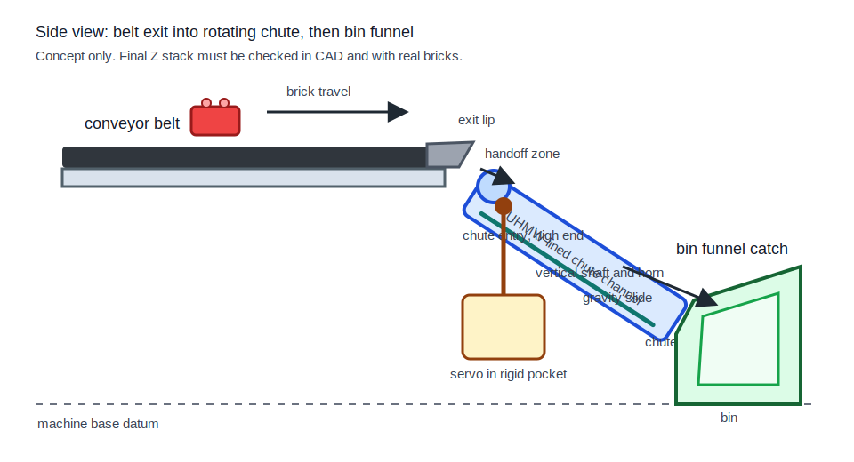
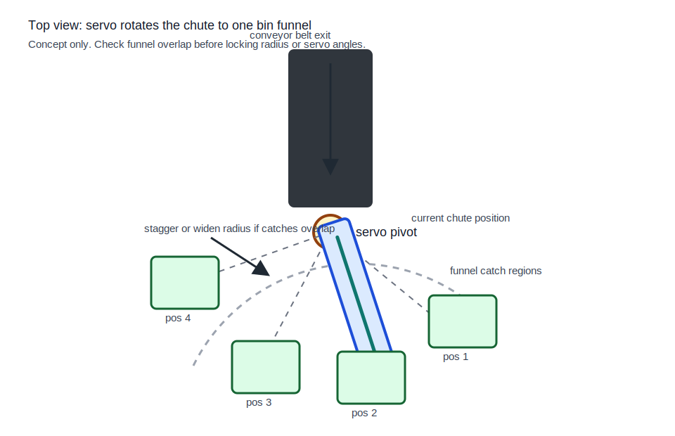
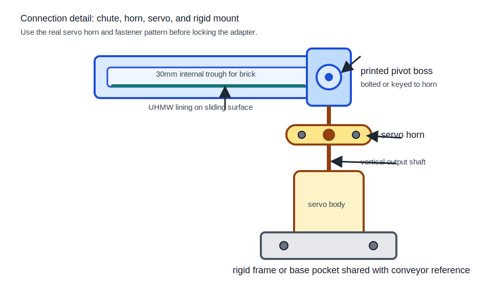

# Servo Rotary Chute Selector - CAD Handoff

## Summary

This is the working CAD handoff for the servo rotary chute selector. The selector concept is decided, but the exact chute radius, funnel catch width, and Z stack are not safe to treat as final until the conveyor, frame, and first real-brick tests agree.

You can start CAD now. Build the selector around a placeholder pivot at Z=90mm and keep the sweep radius, chute slope, and final frame attachment parametric. Do not wait for the whole frame to be finished before modeling the chute, funnels, and motion envelope.

Read `cad/DIMENSIONS.md` section "Servo Rotary Chute Selector Geometry" in parallel with this document for the current dimension table.

## Corrected Assumptions

### Servo Mount

The servo is not a 4 inch diameter part. The MG995/MG996/MG996R-class servo body is roughly a 40mm x 19mm x 43mm rectangular package. Verify the real part and horn before locking the pocket.

The working pivot axis height is Z=90mm from the machine base. Treat that as a CAD starting datum, not final geometry. If the chute entry, chute exit, and bin funnel heights do not line up, change the stack before printing large parts.

The servo output shaft points vertically up. The chute arm rotates in the horizontal plane.

### Entry and Exit Are Different Points

Do not set the chute entry to Z=49-54mm. That was mixing the chute exit with the chute entry.

The chute entry follows the conveyor exit and exit lip. The current conveyor CAD uses local belt coordinates around Z=60mm, with the exit lip about 5mm to 6mm above the belt. If the final frame lifts the conveyor to a global height around 200mm to 300mm, convert those local coordinates into machine-base coordinates.

The chute exit follows the chute slope and bin funnel catch window. It must land inside the funnel, not below or above it.

### Longer Chute Means Lower Exit

At 40 degrees from horizontal, a longer sloped chute drops farther.

If you model a simple chute centerline starting from Z=90mm:
- 65mm centerline length drops about 42mm, so the centerline exit is about Z=48mm before wall offsets
- 75mm centerline length drops about 48mm, so the centerline exit is about Z=42mm before wall offsets

So do not use the old assumption that a 75mm arm gives a higher Z=54mm exit. It gives a lower exit if the slope is the same.

### Funnel Width Must Match Sweep Radius

With four servo positions 35 degrees apart, the catch centers are closer together than they look.

Approximate center-to-center spacing along the arc:
- 65mm radius gives about 39mm spacing
- 75mm radius gives about 45mm spacing
- 83mm radius gives about 50mm spacing
- 100mm radius gives about 60mm spacing

That means a 60mm funnel mouth does not fit cleanly on a 65mm to 75mm sweep radius unless the funnels are staggered, narrowed, or shaped so adjacent catch zones do not overlap.

Start with a 50mm to 60mm funnel mouth only after checking the actual radius. Use 70mm only if the layout proves it can fit.

## Concept Diagrams

This selector is a rotating chute or trough, not a flat spinning disc. The servo turns the chute in the top view. Gravity moves the brick down the chute in the side view.







Brick path:

```text
1. Belt carries brick to exit lip.
2. Exit lip guides the brick into the high end of the rotating chute.
3. Servo has already turned the chute toward the chosen bin.
4. Brick slides down the UHMW-lined chute.
5. Brick exits into the matching funnel catch.
6. Funnel guides the brick into the bin.
```

## Working Geometry

Use these as the first CAD inputs:

- Servo family: MG995/MG996/MG996R-class heavy servo
- Working pivot: Z=90mm from machine base
- Chute internal width: 30mm for 15.8mm as-fed brick width plus yaw and handoff tolerance
- Chute internal height: 15mm
- Chute wall thickness: 3mm minimum
- Chute slope: start at 40 degrees from horizontal, then test 30, 35, 40, and 45 degrees with UHMW
- Servo positions in bin label order: start at 37 degrees for 2x2 RED, 72 degrees for 2x2 BLUE, 107 degrees for 2x3 RED, and 142 degrees for 2x3 BLUE
- Bin internal size: 80mm x 80mm x 60mm
- Bin base: Z=0mm
- UHMW lining: required on chute and funnel sliding surfaces before any meaningful run

Keep these as parameters, not hard-coded geometry:

- Chute sweep radius
- Funnel mouth width
- Funnel catch height
- Absolute pivot XY location
- Servo pocket fastener locations
- Conveyor-to-chute entry height

## CAD Work Sequence

### Phase 1: Selector Sandbox

Start now with a standalone selector sandbox:

1. Put a construction pivot at the origin, Z=90mm.
2. Add four construction rays at 37, 72, 107, and 142 degrees in bin label order.
3. Add a sweep radius parameter.
4. Place temporary funnel catch rectangles at each ray.
5. Check overlap at 65mm, 75mm, 83mm, and 100mm radius.

Deliverable: a quick motion layout that shows whether the selected radius and funnel width can coexist.

### Phase 2: Servo Pocket Test

Model a pocket for the real MG995/MG996-class servo in a small test mount. Measure the real servo body and horn. Print only the pocket test first and verify the servo fits without rocking.

Deliverable: servo pocket CAD, test print, fit confirmation.

### Phase 3: Chute Test Segment

Model a short chute segment with the intended internal channel. Add UHMW and test real bricks at 30, 35, 40, and 45 degrees.

Deliverable: chosen slide angle and notes from real-brick tests.

### Phase 4: Chute Arm and One Funnel

Model the arm, horn adapter, channel, and one funnel. Use the sandbox radius that avoids overlap. Mount with the real servo and test one target position.

Verify:
- Brick enters the chute reliably
- Brick slides without jamming
- Brick exits into the funnel catch window
- No chute or funnel surface catches studs

Deliverable: working chute arm plus one funnel, validated with 5 to 10 real-brick passes.

### Phase 5: Full Four-Bin Selector

Model all four funnels and bins. Test every position with real bricks before committing to larger frame prints.

Verify:
- Catch zones do not overlap in CAD
- Bins fit inside the 610mm x 610mm footprint
- Bins can be removed without hitting the chute
- Servo wiring clears the horn and chute sweep
- Each position routes into the correct labeled bin

Deliverable: full selector assembly with all four positions tested.

### Phase 6: Conveyor and Frame Integration

Tie the servo mount and conveyor mount into the same rigid frame or base reference so the belt exit and chute entry do not drift relative to each other. Do not hang the servo from a thin, flexible belt side plate.

Test the conveyor-to-chute handoff with the real belt speed before running full sorting tests.

## Unknowns That Need Hardware Testing

### Z Stack

The belt exit, chute entry, chute exit, and funnel catch height must be checked together. If the Z=90mm pivot and 40-degree chute make the exit too low for a top-entry funnel, change one of these:

- Raise the pivot
- Reduce the chute slope
- Shorten or reshape the sloped chute path
- Use a side-entry funnel that is intentionally modeled and tested

Do not leave the mismatch hidden in CAD.

### Sweep Radius

Do not assume 65mm to 75mm is enough for four wide funnels. Use the arc spacing check above. If the funnel mouths overlap, increase radius, increase angle spacing, narrow the mouths, or stagger the bins.

### Arm Flex

If the arm flexes, do not solve that by making the cantilever longer. Stiffen it instead:

- Add ribs
- Widen the arm section
- Shorten the unsupported length
- Improve the horn adapter
- Add bearing support if needed

### Servo Accuracy

The starting table assumes the servo can hit repeatable angles well enough for the funnels to catch errors. Validate on the real frame. If it misses, widen the effective catch, increase spacing, or adjust the angle table.

### UHMW Slide Angle

Test the real brick and UHMW surface before finalizing the chute and funnel angles. Open-air or bare-plastic sliding behavior is not the real behavior.

## Frame Geometry Questions

Ask the frame team:

1. Where is the servo pivot center in final machine XYZ coordinates?
2. What rigid frame members can the servo pocket attach to?
3. How much clearance exists around the chute sweep?
4. What is the final conveyor belt height in machine-base coordinates?
5. Can the bins be staggered if the funnel mouths overlap on the arc?
6. Which side should bins be removed from without hitting the chute?

## Validation Checklist

Complete this before declaring the selector ready for system integration:

- [ ] Real servo body and horn measured
- [ ] Servo pocket test-printed and verified
- [ ] Working pivot at Z=90mm checked against final conveyor and bin heights
- [ ] Sweep radius chosen after funnel overlap check
- [ ] Chute entry height derived from belt exit and exit lip
- [ ] Chute exit height derived from slope and funnel catch height
- [ ] Single chute test segment run with UHMW and real bricks
- [ ] Chute arm test-printed and checked for flex
- [ ] If flex appears, arm stiffened instead of lengthened
- [ ] Single funnel test-printed and aligned to one servo angle
- [ ] Brick exits chute and lands inside the funnel catch window
- [ ] All four funnels modeled with no unplanned overlap
- [ ] Servo positions tested in bin label order at 37, 72, 107, and 142 degrees, then adjusted if needed
- [ ] Bins fit inside the 610mm x 610mm footprint
- [ ] Bins can be removed without disturbing the chute
- [ ] Servo wiring clears horn, chute sweep, and brick path
- [ ] UHMW lining installed on chute and funnel sliding surfaces
- [ ] Conveyor-to-chute handoff tested at real belt speed

## Reference Files

- `cad/DIMENSIONS.md` section "Servo Rotary Chute Selector Geometry" for the current spec table
- `docs/datasheet/motion/heavy_servo/` for MG995/MG996-class servo body dimensions
- `docs/ARCHITECTURE.md` for system context and bin arrangement overview
- `cad/MECHANICAL.md` for design rationale and earlier geometry iterations
